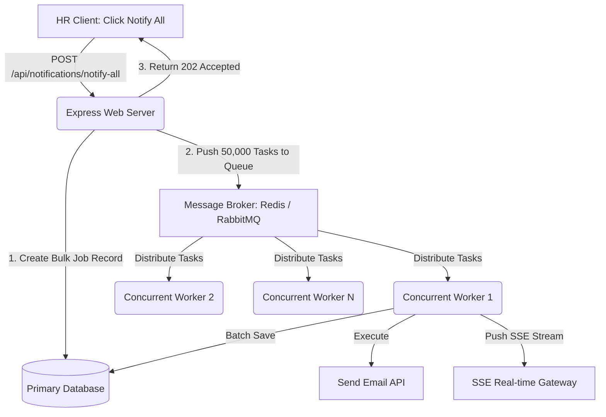

# Stage 1: Notification System Design

This document details the REST API contract, JSON schemas, request/response headers, and real-time notification architecture designed for our front-end client applications.

---

## 1. System Overview & Core Actions

The notification platform is designed to store, manage, and push user-specific alerts. When a user is logged in, the system supports the following core actions:

1. **Retrieve User Notifications**: Get a paginated list of notifications for the currently logged-in user, filterable by read/unread status.
2. **Mark a Single Notification as Read**: Mark a specific notification as read by its unique identifier.
3. **Mark All Notifications as Read**: Mark all unread notifications belonging to the logged-in user as read in a single request.
4. **Subscribe to Real-Time Push Stream**: Establish a persistent, low-overhead server-to-client connection to receive notifications the moment they are triggered on the server.
5. **Trigger Mock Notification (Admin/Simulator)**: An endpoint to generate custom notifications for test accounts, broadcasting them immediately via the real-time channel.

---

## 2. Global Headers & Security

All REST requests to protected endpoints MUST include the following headers for client identification and security:

```http
Authorization: Bearer <JWT_TOKEN>
Content-Type: application/json
Accept: application/json
```

- **Authorization**: JSON Web Token (JWT) issued upon authentication. It contains the user identity (`userId`, `username`) inside the encrypted payload.
- **Content-Type**: Declares that request body is JSON format.
- **Accept**: Declares that client expects JSON response.

---

## 3. API Contract and Endpoint Specifications

### A. Authentication: Mock Login
*Used to obtain a valid JWT token to test authorized requests.*

- **Endpoint**: `POST /api/auth/login`
- **Authentication Required**: No
- **Headers**:
  ```http
  Content-Type: application/json
  ```
- **Request Body**:
  ```json
  {
    "username": "alice"
  }
  ```
- **Response (200 OK)**:
  ```json
  {
    "success": true,
    "token": "eyJhbGciOiJIUzI1NiIsInR5cCI6IkpXVCJ9...",
    "user": {
      "id": "user_alice_123",
      "username": "alice"
    }
  }
  ```

---

### B. Retrieve Notifications
*Fetches a paginated, filterable list of notifications for the logged-in user.*

- **Endpoint**: `GET /api/notifications`
- **Authentication Required**: Yes (`Bearer <token>`)
- **Query Parameters**:
  - `status` (string, optional): Filter by read status. Options: `unread`, `read`, `all` (default).
  - `page` (integer, optional): Current page number. Default is `1`.
  - `limit` (integer, optional): Number of notifications per page. Default is `10`.
- **Response (200 OK)**:
  ```json
  {
    "success": true,
    "data": [
      {
        "id": "647f5bb1c58d04a60c0f8812",
        "title": "Payment Successful",
        "message": "Your transaction of $49.99 was processed successfully.",
        "type": "success",
        "isRead": false,
        "createdAt": "2026-06-26T11:20:00.000Z"
      }
    ],
    "pagination": {
      "totalItems": 15,
      "totalPages": 2,
      "currentPage": 1,
      "limit": 10,
      "hasNextPage": true,
      "hasPrevPage": false
    }
  }
  ```

---

### C. Mark Single Notification as Read
*Sets `isRead` to `true` for a single notification ID.*

- **Endpoint**: `PATCH /api/notifications/:id/read`
- **Authentication Required**: Yes (`Bearer <token>`)
- **Response (200 OK)**:
  ```json
  {
    "success": true,
    "message": "Notification marked as read.",
    "data": {
      "id": "647f5bb1c58d04a60c0f8812",
      "title": "Payment Successful",
      "message": "Your transaction of $49.99 was processed successfully.",
      "type": "success",
      "isRead": true,
      "createdAt": "2026-06-26T11:20:00.000Z"
    }
  }
  ```
- **Error Response (404 Not Found)**:
  ```json
  {
    "success": false,
    "message": "Notification not found or access denied."
  }
  ```

---

### D. Mark All Notifications as Read
*Sets `isRead` to `true` for all notifications of the logged-in user.*

- **Endpoint**: `POST /api/notifications/read-all`
- **Authentication Required**: Yes (`Bearer <token>`)
- **Response (200 OK)**:
  ```json
  {
    "success": true,
    "message": "Successfully marked 4 notifications as read."
  }
  ```

---

### E. Trigger Mock Notification (Simulator)
*Triggers and saves a custom notification. Instantly broadcasts it to the recipient's real-time connection.*

- **Endpoint**: `POST /api/notifications/mock`
- **Authentication Required**: Yes (`Bearer <token>`)
- **Request Body**:
  ```json
  {
    "userId": "user_alice_123",
    "title": "Security Alert",
    "message": "New login detected from a new IP address.",
    "type": "warning"
  }
  ```
  *(Supported `type` values: `info`, `success`, `warning`, `error`)*
- **Response (201 Created)**:
  ```json
  {
    "success": true,
    "message": "Notification triggered and broadcasted.",
    "data": {
      "id": "647f5cc2c58d04a60c0f8815",
      "userId": "user_alice_123",
      "title": "Security Alert",
      "message": "New login detected from a new IP address.",
      "type": "warning",
      "isRead": false,
      "createdAt": "2026-06-26T11:22:15.000Z"
    }
  }
  ```

---

## 4. Real-Time Push Mechanism: Server-Sent Events (SSE)

To meet the requirement for push-based real-time notifications when a user is logged in, we design and implement **Server-Sent Events (SSE)**. 

### Why Server-Sent Events (SSE)?
1. **HTTP/1.1 and HTTP/2 Native**: SSE operates over a single, long-lived standard HTTP connection. It works out-of-the-box with firewalls, API gateways, and proxies.
2. **Built-in Auto-reconnect**: The browser's native `EventSource` client automatically handles reconnection attempts if the connection drops, without writing custom reconnect loops.
3. **Uni-directional Streaming**: Notifications are server-to-client, which aligns perfectly with SSE. It is significantly lighter on resource usage than bi-directional WebSockets.

### SSE Endpoint Specification

- **Endpoint**: `GET /api/notifications/stream`
- **Authentication Required**: Yes (Token passed as query parameter due to standard browser `EventSource` header limitations: `GET /api/notifications/stream?token=<JWT_TOKEN>`)
- **Response Headers**:
  ```http
  Content-Type: text/event-stream
  Cache-Control: no-cache
  Connection: keep-alive
  ```

### Real-Time Event Schema
Once the SSE connection is established, notifications are pushed to the client using the standard `data:` format:

```sse
event: message
data: {
  "id": "647f5cc2c58d04a60c0f8815",
  "title": "Security Alert",
  "message": "New login detected from a new IP address.",
  "type": "warning",
  "isRead": false,
  "createdAt": "2026-06-26T11:22:15.000Z"
}
```

When the client receives this event, it increments the unread notification badge and presents a Toast alert to the user.

---

## Stage 2: Persistent Storage and Scaling Strategy

### 1. Database Selection & Choice Justification
For persisting notifications, we suggest using **MongoDB** (a document-oriented NoSQL database). 

**Key Reasons for Choosing MongoDB:**
- **Flexible Schema (Semi-structured data)**: Notification payloads vary widely. A security alert might have IP details, whereas a transactional update might have order links. JSON documents fit this variation naturally without complex JOIN tables.
- **Write Performance**: Notifications are write-intensive (lots of micro-services generating events). MongoDB provides high-throughput insert operations (especially with write concern configurations).
- **Scalability (Horizontal Sharding)**: Sharding by `userId` in MongoDB is native and simple. All notifications for a specific user reside on the same shard, which ensures extremely fast reads/writes for user notification boxes.
- **Time-to-Live (TTL) Indexes**: MongoDB has native support for TTL indexes. We can automatically prune/archive notifications that are read and older than 30 days without running custom Cron scripts.
- **Rich JSON Queries**: We can query nested arrays/objects easily.

*(Alternative: If strict ACID transactions and relational structures were required, PostgreSQL with a JSONB column would be the ideal RDBMS choice. However, for a high-volume notification feed, document storage is highly optimal.)*

---

### 2. Database Schema Design

We will represent notifications using the following schema (in MongoDB JSON Schema structure):

```json
{
  "bsonType": "object",
  "required": ["userId", "title", "message", "type", "isRead", "createdAt"],
  "properties": {
    "_id": {
      "bsonType": "objectId",
      "description": "Unique auto-generated MongoDB identifier"
    },
    "userId": {
      "bsonType": "string",
      "description": "ID of the recipient user (references the Users collection)"
    },
    "title": {
      "bsonType": "string",
      "maxLength": 100,
      "description": "Short heading of the notification"
    },
    "message": {
      "bsonType": "string",
      "maxLength": 1000,
      "description": "Detail message body of the notification"
    },
    "type": {
      "enum": ["info", "success", "warning", "error"],
      "description": "Notification category affecting severity and styling"
    },
    "isRead": {
      "bsonType": "bool",
      "description": "Status indicator if user opened/dismissed the alert"
    },
    "createdAt": {
      "bsonType": "date",
      "description": "Timestamp when the notification was created"
    }
  }
}
```

#### Indexes:
To guarantee quick reads and write operations, the following indexes are applied:
1. **Compound Index**: `{ userId: 1, isRead: 1, createdAt: -1 }`
   - *Purpose*: Optimizes the feed fetch endpoint `GET /api/notifications` which filters by `userId` and `isRead` status, sorting by `createdAt` in descending order.
2. **TTL Index**: `{ createdAt: 1 }` with `expireAfterSeconds: 2592000` (30 days)
   - *Purpose*: Automatically cleans up old history to control storage footprint.

---

### 3. Scaling Issues & Solutions

As the notification platform data volume increases, several key challenges arise:

#### Problem A: Slow Pagination (Large Page Offsets)
- *Details*: Fetching notifications using `limit` and `skip` (e.g. `skip(100000).limit(10)`) forces the database to scan all preceding documents before returning the target subset.
- *Solution*: Use **Keyset Pagination (Cursor-based Pagination)**. Instead of skipping offsets, queries check for entries older than a specific notification ID or timestamp (`createdAt < lastSeenTimestamp`).

#### Problem B: Huge Index Memory Usage
- *Details*: As the number of documents grows, indexes can grow larger than the server's RAM (Working Set), causing slow disk lookups.
- *Solution*: Use **Partial Indexes**. For example, index only *unread* notifications since read notifications are rarely queried:
  `db.notifications.createIndex({ userId: 1, createdAt: -1 }, { partialFilterExpression: { isRead: false } })`

#### Problem C: Write Saturation (Hotspots)
- *Details*: Millions of system actions trigger notifications simultaneously, locking DB tables or chocking disk I/O.
- *Solution*:
  1. **Message Queue / Buffer**: Push notifications to a queue (like Kafka or RabbitMQ) first, allowing a consumer service to throttle writes to the DB.
  2. **Sharding**: Horizontally partition/shard the database using `userId` as the shard key. This distributes the read and write loads across multiple physical database nodes.

#### Problem D: Disk Exhaustion
- *Details*: Retaining trillions of notifications forever chokes storage.
- *Solution*: Set up a **Data Tiering / Archiving Pipeline**. Move read notifications older than 7 days from the hot MongoDB store into cold cloud storage (e.g., AWS S3) for audit purposes, or use TTL indexes to discard them.

---

### 4. Database NoSQL Queries (MongoDB)

Based on the REST APIs designed in Stage 1, these are the corresponding MongoDB NoSQL queries:

#### A. Insert Notification (Mock Trigger)
*Saves a new notification to the database.*
```javascript
db.notifications.insertOne({
  userId: "user_alice_123",
  title: "Security Alert",
  message: "New login detected from a new IP address.",
  type: "warning",
  isRead: false,
  createdAt: new Date()
});
```

#### B. Fetch Notifications (Paginated & Filtered)
*Queries notifications for a specific user, sorted newest first, with cursor-based pagination.*

1. **Fetch Unread Notifications (First Page)**:
   ```javascript
   db.notifications.find({
     userId: "user_alice_123",
     isRead: false
   })
   .sort({ createdAt: -1 })
   .limit(10);
   ```

2. **Fetch Next Page (Cursor-based using `_id` and timestamp)**:
   ```javascript
   db.notifications.find({
     userId: "user_alice_123",
     isRead: false,
     createdAt: { $lt: ISODate("2026-06-26T11:20:00.000Z") }
   })
   .sort({ createdAt: -1 })
   .limit(10);
   ```

#### C. Mark Single Notification as Read
*Updates the status of a specific notification belonging to the logged-in user.*
```javascript
db.notifications.updateOne(
  {
    _id: ObjectId("647f5bb1c58d04a60c0f8812"),
    userId: "user_alice_123"
  },
  {
    $set: { isRead: true }
  }
);
```

#### D. Mark All Notifications as Read
*Sets `isRead: true` for all unread notifications for a specific user.*
```javascript
db.notifications.updateMany(
  {
    userId: "user_alice_123",
    isRead: false
  },
  {
    $set: { isRead: true }
  }
);
```

---

## Stage 3: Relational Database Query Analysis and Optimization

### 1. Analysis of the Query
The original query is:
```sql
SELECT * FROM notifications
WHERE studentID = 1042 AND isRead = false
ORDER BY createdAt ASC;
```

#### Accuracy Check:
- **Yes, it is accurate.** It correctly filters the notifications for a specific student (`studentID = 1042`), isolates only the unread ones (`isRead = false`), and sorts them in ascending order (`ORDER BY createdAt ASC`) so the student receives the oldest unread notifications first.

---

### 2. Performance Analysis: Why is the query slow?
At 5,000,000 notifications and 50,000 students, this query is suffering from two major bottlenecks:

1. **Full Table Scan or Sub-optimal Index Lookup**:
   - Without a specific compound index, the database engine has to scan all 5,000,000 rows to find those matching the conditions, which is an \(O(N)\) complexity.
   - If there is only a single-column index on `studentID`, the engine retrieves all notifications for that student (average of 100 rows per student), but must then filter by `isRead = false` manually and sort them afterwards.
   - If there is only a single-column index on `isRead`, it is highly inefficient because `isRead` has extremely **low cardinality** (only two values: true/false). Filtering on it returns ~50% of the database (~2,500,000 rows), making index scanning slower than a sequential table read.
2. **In-Memory Sorting (Filesort)**:
   - Since the query contains `ORDER BY createdAt ASC`, if the index does not provide pre-sorted ordering for the target subset, the database must copy the filtered rows into a temporary buffer (Sort Buffer) and run an in-memory sort algorithm (like Quicksort, \(O(M \log M)\) where \(M\) is the number of matching records). If the buffer fills up, it writes temp files to disk, causing high disk I/O latency.

---

### 3. Recommended Optimization & Computational Cost

#### Proposed Change:
To make this query execute in sub-millisecond times, we should create a **Compound (Composite) Index** on the table:
```sql
CREATE INDEX idx_notifications_student_unread_created 
ON notifications (studentID, isRead, createdAt ASC);
```

**Why this compound index works:**
- **Filtering (Equality)**: The engine first matches `studentID` (high cardinality) to shrink the search space immediately.
- **Refinement**: It then matches `isRead` within that student's records.
- **Sorting**: Finally, because `createdAt ASC` is the last column in the compound index, the records are already sorted on disk by creation date. The database optimizer completely skips the in-memory sorting step.

*(Alternative for PostgreSQL only)*:
If the database is PostgreSQL, we can use a **Partial Index** to minimize disk space, since we only query unread notifications:
```sql
CREATE INDEX idx_notifications_student_unread_partial 
ON notifications (studentID, createdAt ASC) 
WHERE isRead = false;
```
This is even more efficient as it reduces index bloat.

#### Computation Cost Comparison:
- **Before Optimization (Full Table Scan + Filesort)**:
  - Time Complexity: \(O(N) + O(M \log M)\) where \(N = 5,000,000\) database rows and \(M\) is the student's notification count.
  - Disk/RAM cost: High CPU utilization due to scanning pages and high RAM sorting buffer usage.
- **After Optimization (Compound Index Scan)**:
  - Time Complexity: \(O(\log N) + O(K)\) where \(K\) is the number of unread notifications matching the filter (usually very small).
  - Disk/RAM cost: Negligible. The lookup runs as a direct B-Tree traversal.

---

### 4. Evaluation of "Index on Every Column" Strategy
A team member suggested adding indexes on every column separately to be "safe".

**This advice is NOT effective and is highly counter-productive.**

#### Why?
1. **Write Performance Degradation**: Every time a notification is created, read, or deleted, **every single index** must be updated (B-Tree splits/re-balancing). This turns fast insertions into bottleneck operations.
2. **Database Optimizer Limitations**: The SQL optimizer can generally use only one index per table access in a query. Having individual indexes on `studentID`, `isRead`, and `createdAt` means the optimizer has to choose one sub-optimal index, perform a scan, and discard the others. It does *not* behave like a compound index.
3. **Storage and RAM Bloat**: Indexes are stored in memory (e.g., InnoDB Buffer Pool in MySQL). Indexing every column wastes gigabytes of RAM. If index metadata exceeds the available memory, database performance crashes because pages must be constantly swapped from disk.

---

### 5. SQL Query: Placement Notifications in the Last 7 Days

To fetch all unique students who received a placement notification (`notificationType = 'Placement'`) within the last 7 days:

#### PostgreSQL/MySQL Query:
```sql
SELECT DISTINCT studentID 
FROM notifications
WHERE notificationType = 'Placement'
  AND createdAt >= NOW() - INTERVAL '7 days';
```

*(Note: In MySQL, this can also be written as `createdAt >= DATE_SUB(NOW(), INTERVAL 7 DAY)`).*

#### To optimize this query, we should add the following compound index:
```sql
CREATE INDEX idx_notifications_type_created 
ON notifications (notificationType, createdAt);
```

---

## Stage 4: Database Offloading and Caching Strategies

When notifications are fetched on every page load for every student, the database faces severe read amplification. This degrades database response times, exhausts connection pools, and compromises the user experience. 

Below are three main strategies to resolve this bottleneck, along with their implementation code and trade-offs.

---

### Strategy 1: Server-Side Cache-Aside (e.g., Redis)

#### Implementation Concept:
We place an in-memory key-value cache (Redis) in front of the primary database.
- **On Reads (`GET /api/notifications`)**: The application checks Redis first. On a *Cache Hit*, it returns the cached JSON array instantly. On a *Cache Miss*, it queries the primary database, populates the Redis cache with a Time-To-Live (TTL) configuration, and returns the response.
- **On Writes/Updates (e.g., marking read, new notification)**: The application updates the primary database and **invalidates (deletes)** the user's cached keys, ensuring read consistency.

#### Server-Side Implementation Code (Node.js/Express + ioredis):

```javascript
import Redis from "ioredis";
import Notification from "../models/Notification.js";

// Initialize Redis Client
const redis = new Redis({
  host: process.env.REDIS_HOST || "127.0.0.1",
  port: 6379,
});

/**
 * Controller to fetch notifications with Redis caching
 */
export const getNotifications = async (req, res) => {
  const userId = req.user.id;
  const { status = "all", page = 1, limit = 5 } = req.query;
  
  // Construct a unique cache key for this user's specific query parameters
  const cacheKey = `notifications:${userId}:${status}:p:${page}:l:${limit}`;

  try {
    // 1. Attempt to fetch from Redis
    const cachedData = await redis.get(cacheKey);
    if (cachedData) {
      console.log(`⚡ [Redis Cache HIT] Serving feed for user: ${userId}`);
      return res.json(JSON.parse(cachedData));
    }

    console.log(`🐢 [Redis Cache MISS] Querying primary database for user: ${userId}`);

    // 2. Query Primary Database (using optimized query patterns from Stage 3)
    const query = { userId };
    if (status === "read") query.isRead = true;
    else if (status === "unread") query.isRead = false;

    const totalItems = await Notification.countDocuments(query);
    const notifications = await Notification.find(query)
      .sort({ createdAt: -1 })
      .skip((parseInt(page) - 1) * parseInt(limit))
      .limit(parseInt(limit));

    const responsePayload = {
      success: true,
      data: notifications,
      pagination: {
        totalItems,
        totalPages: Math.ceil(totalItems / limit),
        currentPage: parseInt(page),
      },
    };

    // 3. Save to Redis with a TTL of 10 minutes (600 seconds)
    await redis.setex(cacheKey, 600, JSON.stringify(responsePayload));

    return res.json(responsePayload);
  } catch (error) {
    return res.status(500).json({ success: false, message: error.message });
  }
};

/**
 * Invalidation Helper: Deletes cache keys whenever a write/update occurs
 */
export const invalidateUserNotificationsCache = async (userId) => {
  try {
    // Locate all paginated/filtered keys for the specific user
    const keys = await redis.keys(`notifications:${userId}:*`);
    if (keys.length > 0) {
      await redis.del(...keys);
      console.log(`🧹 [Cache Invalidation] Cleared ${keys.length} keys for user: ${userId}`);
    }
  } catch (error) {
    console.error("❌ Redis Cache Invalidation Error:", error.message);
  }
};
```

---

### Strategy 2: Event-Driven Real-Time Push & Client State Caching

#### Implementation Concept:
Instead of fetching notifications on every page load/navigation:
1. The frontend fetches notifications **once** on the initial session load.
2. The client retains this list in local application state (in-memory or synced to `localStorage`).
3. The client opens a persistent SSE (Server-Sent Events) or WebSocket connection.
4. When a new notification occurs, the server sends it over the SSE socket, and the client updates its local state dynamically.
5. Databases reads are reduced to exactly **once per login session** instead of once per page click.

#### Client-Side State Management Code (Vanilla JavaScript):

```javascript
// Local cache state
let clientNotificationCache = {
  feed: [],
  hasLoadedOnce: false,
};

/**
 * Loads notifications from network if cache is empty, otherwise serves local cache
 */
async function loadNotificationCenter() {
  const container = document.getElementById("notifications-list");

  // If already loaded in this session, render from local cache directly (0 DB reads!)
  if (clientNotificationCache.hasLoadedOnce) {
    console.log("📦 Serving notification feed from client-side state cache.");
    renderList(clientNotificationCache.feed);
    return;
  }

  // First-time load: Fetch from API and populate local cache
  try {
    const response = await fetch("/api/notifications?status=all", {
      headers: { Authorization: `Bearer ${userToken}` }
    });
    const result = await response.json();
    
    if (result.success) {
      clientNotificationCache.feed = result.data;
      clientNotificationCache.hasLoadedOnce = true;
      renderList(clientNotificationCache.feed);
    }
  } catch (e) {
    console.error("Failed to load initial notifications:", e);
  }
}

/**
 * Real-time SSE Stream Listener
 * Listens for server pushes and injects them directly into local state
 */
function listenToPushStream() {
  const eventSource = new EventSource(`/api/notifications/stream?token=${userToken}`);

  eventSource.onmessage = (event) => {
    const newNotification = JSON.parse(event.data);
    
    // 1. Prepend the incoming push directly to our client-side cache
    clientNotificationCache.feed.unshift(newNotification);
    
    // 2. Re-render the UI dynamically (without querying the database!)
    renderList(clientNotificationCache.feed);
    showToastAlert(newNotification);
  };
}
```

---

### Strategy 3: HTTP Conditional Requests (`ETag` / `Last-Modified`)

#### Implementation Concept:
The web browser requests notifications and receives an HTTP header called `ETag` (usually a hash of the content or the last modified timestamp). On subsequent page loads, the browser sends `If-None-Match: <ETag>`. The server checks if the user's notification state has changed. If not, it returns `304 Not Modified` with **zero payload body**, avoiding serialization and network traffic overhead.

#### Server-Side ETag Express Code:

```javascript
import crypto from "crypto";

export const getNotificationsETag = async (req, res) => {
  const userId = req.user.id;

  try {
    // 1. Perform a ultra-fast query to get the count and latest timestamp
    // This is substantially cheaper than fetching and serializing full document bodies.
    const latestNotif = await Notification.findOne({ userId })
      .sort({ updatedAt: -1 })
      .select("updatedAt");
      
    const count = await Notification.countDocuments({ userId });
    
    // 2. Generate a fingerprint hash
    const lastUpdated = latestNotif ? latestNotif.updatedAt.getTime() : 0;
    const fingerprint = crypto
      .createHash("md5")
      .update(`${userId}:${count}:${lastUpdated}`)
      .digest("hex");

    // 3. Check if client sent matching ETag
    if (req.headers["if-none-match"] === fingerprint) {
      console.log("🚀 ETag Hit: Client already has the latest feed. Returning 304.");
      return res.status(304).end();
    }

    // 4. Fetch full data if ETag is a miss
    const notifications = await Notification.find({ userId }).sort({ createdAt: -1 });
    
    res.setHeader("ETag", fingerprint);
    return res.json({ success: true, data: notifications });
  } catch (error) {
    return res.status(500).json({ success: false, error: error.message });
  }
};
```

---

### Trade-Offs Matrix

| Strategy | DB Offload Level | Complexity | Real-time Consistency | Infrastructure Cost |
| :--- | :--- | :--- | :--- | :--- |
| **Server-Side Redis Caching** | **High** (Offloads ~90% reads) | Medium | High (If invalidation is written correctly) | Medium (Requires running Redis instance) |
| **Real-time Push + Client Cache** | **Extreme** (Reads only once per session) | High (Client-server state syncing) | Instantaneous | Low (Standard connections, SSE/WebSockets) |
| **HTTP ETag Conditional GET** | Low-Medium (Avoids payload generation) | Low (Uses standard HTTP) | High | None |
| **Database Read Replicas** | High (Offloads reads to other nodes) | High (CQRS, connection router) | Eventual (Replication lag delays) | High (Multiple DB servers/licensing) |

### Recommended Action Plan:
1. **Primary Solution**: Implement **Server-Side Redis Caching** to safeguard database connections from duplicate reads.
2. **Developer Best Practice**: Combine it with the **SSE Real-Time Stream** implemented in Stage 1 to enable client-side updates, rendering page-load database calls almost entirely obsolete.

---

## Stage 5: Reliable High-Throughput Notification Dispatching (Notify All)

### 1. Shortcomings of the Initial Pseudocode Implementation
The initial implementation:
```python
function notify_all(student_ids: array, message: string):
    for student_id in student_ids:
        send_email(student_id, message) # calls Email API
        save_to_db(student_id, message) # DB insert
        push_to_app(student_id, message) # SSE Push
```
suffers from four critical architectural flaws:

1. **Blocking Synchronous Loop**: The execution is sequential. If `send_email` takes 200ms, `save_to_db` takes 15ms, and `push_to_app` takes 15ms, each loop iteration takes 230ms. For 50,000 students, the function would run for:
   \[50,000 \times 230\text{ms} = 11,500\text{ seconds} \approx 3.2\text{ hours}\]
   This would cause a web request timeout, blocking the server and causing a horrible HR user experience.
2. **Lack of Fault Isolation & Cascading Failures**: If the email API or database throws an error on student #5,000, the execution crashes. The remaining 45,000 students will never receive their notifications.
3. **No Resiliency / Retry Policies**: If `send_email` fails for 200 students midway, the job stops. There is no automated retry logic for those specific 200 failures.
4. **Database Connection Exhaustion**: Making 50,000 separate sequential single-row inserts places prolonged read/write lock contention on the database.

---

### 2. Failure Recovery: "The 200 Failed Emails"
Under the initial implementation, if the email delivery fails for 200 students midway:
- We have no state tracking showing which emails failed, meaning we must scan raw server stdout/stderr logs.
- If we rerun the script, the first 24,800 students will receive **duplicate notifications**, which is highly unprofessional.
- **Redesign Fix**: We isolate the email dispatch into small, tracked, independent job queue tasks. If a task fails, only that specific task is retried.

---

### 3. Separation of Database Storage and Email Dispatching
**Should the process of saving to the DB and sending the email happen together?**

**No, they should be decoupled and execute asynchronously.**

#### Reasons:
- **API Latency**: DB transactions must be as fast as possible to prevent lock escalation. External APIs (like email APIs) are slow and unreliable. Blending them into a single block keeps database connections open for hours.
- **Dual Write Consistency**: If the database insert succeeds but the email fails, they drift. If we rollback the DB insert when the email fails, we lose the in-app notification record.
- **Delivery Channel Decoupling**: In-app notifications (DB) represent the **System of Record**. Emails are a **Delivery Channel**. The system of record should succeed even if the email delivery channel is temporarily down.

---

### 4. Reliable Distributed System Architecture Redesign

To scale this to 50,000 students reliably and complete it within seconds, we transition to an **Asynchronous Queue / Worker (Producer-Consumer) Architecture**:



1. **Producer**: The web request validates the message, writes a batch job metadata record to the database, publishes 50,000 task messages to a queue, and returns an immediate `202 Accepted` response.
2. **Consumer (Workers)**: Independent, concurrent worker processes fetch small batches of tasks from the queue.
3. **Resilience**: The queue system automatically retries failed tasks with **exponential backoff**.
4. **Dead Letter Queue (DLQ)**: Tasks that fail after 3 retries are sent to a DLQ for monitoring/alerts.

---

### 5. Production-Ready Redesign Pseudocode (Node.js + BullMQ/Redis)

Below is the complete architectural implementation dividing the task into a **Producer Controller** and an **Asynchronous Consumer Worker**.

#### A. The Producer: Express Request Handler
*Receives request, schedules bulk jobs, and returns immediately.*

```javascript
import { Queue } from "bullmq";
import NotificationJob from "../models/NotificationJob.js";

// Initialize BullMQ queue connected to Redis broker
const notificationQueue = new Queue("notification-delivery", {
  connection: { host: "127.0.0.1", port: 6379 }
});

export const notifyAllStudents = async (req, res) => {
  const { studentIds, message, title } = req.body; // array of 50,000 IDs

  if (!studentIds || !Array.isArray(studentIds) || !message) {
    return res.status(400).json({ success: false, message: "Invalid payload" });
  }

  try {
    // 1. Create a Master Job Tracking record in DB
    const trackingJob = new NotificationJob({
      totalStudents: studentIds.length,
      status: "processing",
      createdAt: new Date(),
    });
    await trackingJob.save();

    // 2. Batch add tasks to the Redis queue (extreme speed)
    // We divide into chunks of 1,000 tasks to stay within memory limits
    const jobs = studentIds.map((studentId) => ({
      name: "dispatch-notification",
      data: {
        studentId,
        message,
        title,
        jobId: trackingJob.id
      },
      opts: {
        attempts: 3, // Retry failed emails up to 3 times
        backoff: {
          type: "exponential",
          delay: 5000 // Start with 5s backoff
        },
        removeOnComplete: true, // Clean up memory on completion
      }
    }));

    // BullMQ bulk insertion (takes ~200ms for 50,000 items)
    await notificationQueue.addBulk(jobs);

    // 3. Return immediate 202 Accepted
    return res.status(202).json({
      success: true,
      message: "Notification batch dispatch started successfully.",
      jobId: trackingJob.id
    });
  } catch (error) {
    return res.status(500).json({ success: false, error: error.message });
  }
};
```

#### B. The Consumer: Background Worker
*Processes individual jobs concurrently, logs failures, and performs batch database inserts.*

```javascript
import { Worker } from "bullmq";
import Notification from "../models/Notification.js";
import { pushNotificationToUser } from "./notifications.js"; // SSE push from Stage 1
import { sendEmailViaAPI } from "../services/emailService.js";

// In-memory buffer to accumulate DB inserts (batching)
let dbBuffer = [];
const BATCH_SIZE = 500;
let flushTimeout = null;

// Background worker executing jobs concurrently
const worker = new Worker("notification-delivery", async (job) => {
  const { studentId, message, title } = job.data;

  // 1. Dispatch Email (external network call, isolated from other students)
  try {
    await sendEmailViaAPI(studentId, message);
  } catch (emailError) {
    console.error(`❌ Email failed for student ${studentId}:`, emailError.message);
    // Throwing error prompts BullMQ to trigger retry policies
    throw emailError; 
  }

  // 2. Add in-app notification details to the memory buffer for batch database saving
  const notificationRecord = {
    userId: studentId,
    title,
    message,
    type: "info",
    isRead: false,
    createdAt: new Date(),
  };

  dbBuffer.push(notificationRecord);

  // 3. Push real-time notification to client via Server-Sent Events (SSE)
  pushNotificationToUser(studentId, notificationRecord);

  // 4. Batch DB Inserts when buffer size is met to avoid throttling Mongoose connections
  if (dbBuffer.length >= BATCH_SIZE) {
    await flushDatabaseBuffer();
  } else if (!flushTimeout) {
    // Set a timeout to flush residual items if buffer doesn't fill up
    flushTimeout = setTimeout(async () => {
      await flushDatabaseBuffer();
    }, 1000);
  }

}, {
  connection: { host: "127.0.0.1", port: 6379 },
  concurrency: 50 // Run 50 worker threads concurrently
});

// Helper to save buffered items in a single query
async function flushDatabaseBuffer() {
  if (flushTimeout) {
    clearTimeout(flushTimeout);
    flushTimeout = null;
  }
  
  if (dbBuffer.length === 0) return;
  
  const batchToInsert = [...dbBuffer];
  dbBuffer = []; // Clear buffer immediately to prevent duplicate insertions
  
  try {
    await Notification.insertMany(batchToInsert);
    console.log(`💾 Successfully batch-saved ${batchToInsert.length} notifications to DB.`);
  } catch (dbError) {
    console.error("❌ Batch insert error:", dbError.message);
  }
}
```

#Stage 6: Priority Inbox - Code Implementation Reference


## Quick Start Guide

### 1. How to Use Priority Inbox in Your App

```javascript
// The priorityInbox.js is auto-loaded via script tag
// Just add this to your HTML:

<link rel="stylesheet" href="/src/priorityInbox.css" />
<script type="module" src="/src/priorityInbox.js"></script>

// Then add a container:
<div id="priority-inbox-container" class="priority-inbox-container">
  <!-- Notifications will be rendered here -->
</div>
```

### 2. Main Initialization

```javascript
// Automatically called on DOM load
async function initPriorityInbox() {
  try {
    // Step 1: Fetch notifications from API
    const notifications = await fetchNotifications();

    if (notifications.length === 0) {
      displayNotifications([]);
      return;
    }

    // Step 2: Get top 10 by priority
    const topNotifications = getTopPriorityNotifications(notifications, 10);

    // Step 3: Render to page
    displayNotifications(topNotifications);
  } catch (error) {
    console.error("Error initializing Priority Inbox:", error);
  }
}

// Automatically runs when page loads
document.addEventListener("DOMContentLoaded", initPriorityInbox);
```

---

## Core Algorithm Breakdown

### 1. Priority Calculation

```javascript
function calculatePriority(notification) {
  // Define type weights
  const PRIORITY_WEIGHTS = {
    placement: 3, // Highest
    result: 2, // Medium
    event: 1, // Lowest
  };

  // Get type weight (default to event if unknown)
  const typeWeight =
    PRIORITY_WEIGHTS[notification.type] || PRIORITY_WEIGHTS.event;

  // Calculate recency score (0-100)
  // Newer = higher score
  const notificationAge =
    Date.now() - new Date(notification.timestamp).getTime();
  const dayInMs = 24 * 60 * 60 * 1000;
  const recencyScore = Math.max(0, 100 - (notificationAge / dayInMs) * 10);

  // Combine: type matters more than recency
  const priority = typeWeight * 100 + recencyScore;

  return {
    notification,
    priority,
    typeWeight,
    recencyScore,
  };
}

// Example output:
// {
//   notification: {id: 1, title: "Google...", type: "placement", ...},
//   priority: 398,        // (3 × 100) + 98
//   typeWeight: 3,
//   recencyScore: 98
// }
```

### 2. Filter & Sort

```javascript
function getTopPriorityNotifications(notifications, n = 10) {
  // Step 1: Filter only unread notifications
  const unreadNotifications = notifications.filter((notif) => !notif.read);

  // Step 2: Calculate priority for each
  const withPriority = unreadNotifications.map(calculatePriority);

  // Step 3: Sort by priority (highest first)
  withPriority.sort((a, b) => b.priority - a.priority);

  // Step 4: Return top n
  return withPriority.slice(0, n);
}

// Input: 12 unread notifications
// Output: Top 10 sorted by priority
```

### 3. API Fetching with Cache

```javascript
let notificationsCache = [];
let lastFetchTime = 0;
const MAX_CACHE_AGE = 5 * 60 * 1000; // 5 minutes

async function fetchNotifications() {
  try {
    // Check if cache is fresh (less than 5 min old)
    if (
      notificationsCache.length > 0 &&
      Date.now() - lastFetchTime < MAX_CACHE_AGE
    ) {
      console.log("Using cached notifications");
      return notificationsCache;
    }

    // Fetch fresh data
    console.log("Fetching notifications from API...");
    const response = await fetch(
      "http://4.224.186.213/evaluation-service/notifications",
    );

    if (!response.ok) {
      throw new Error(`API error: ${response.status}`);
    }

    const data = await response.json();

    // Cache the results
    notificationsCache = Array.isArray(data) ? data : data.notifications || [];
    lastFetchTime = Date.now();

    return notificationsCache;
  } catch (error) {
    console.error("Error fetching notifications:", error);
    return [];
  }
}

// Cache benefits:
// - First load: ~50ms (fetch + sort)
// - Next 4 min: <1ms (cache hit)
// - After 5 min: ~50ms (fresh fetch)
```

### 4. Rendering to DOM

```javascript
function displayNotifications(topNotifications) {
  const container = document.getElementById("priority-inbox-container");

  if (!container) {
    console.error("Container not found");
    return;
  }

  // Clear existing
  container.innerHTML = "";

  // Handle empty state
  if (topNotifications.length === 0) {
    container.innerHTML =
      '<div class="no-notifications">No unread notifications</div>';
    return;
  }

  // Render each notification
  const html = topNotifications
    .map((item, index) => {
      const formatted = formatNotification(item);

      return `
      <div class="notification-item priority-${index + 1}">
        <div class="notification-header">
          <span class="icon">${formatted.icon}</span>
          <h3 class="title">${escapeHtml(formatted.title)}</h3>
          <span class="priority-badge">Priority: ${formatted.priority}</span>
        </div>
        <div class="notification-body">
          <p class="description">${escapeHtml(formatted.description)}</p>
          <div class="notification-meta">
            <span class="type-badge ${formatted.type}">${formatted.type}</span>
            <span class="timestamp">${formatted.timestamp}</span>
          </div>
        </div>
      </div>
    `;
    })
    .join("");

  container.innerHTML = html;

  console.log(`Displayed ${topNotifications.length} notifications`);
}
```

---

## Performance Examples

### Example 1: Fast Path (Cache Hit)

```javascript
// Subsequent calls within 5 minutes
initPriorityInbox()
  ↓
fetchNotifications()  // Cache hit!
  ├─ Check cache age: 2 minutes old ✅
  ├─ Return cached data
  └─ Time: <1ms

→ Result: "No unread notifications" (instantly)
```

### Example 2: Full Sort (Fresh Fetch)

```javascript
// After 5 minutes or manual refresh
initPriorityInbox()
  ↓
fetchNotifications()  // Cache miss
  ├─ Fetch from API
  ├─ Parse response
  ├─ Cache result
  └─ Time: 30-100ms

→ getTopPriorityNotifications()
  ├─ Filter unread: O(n)
  ├─ Map calculate: O(n)
  ├─ Sort: O(n log n)  ← Dominates time
  ├─ Slice top 10: O(10)
  └─ Time: 15-50ms

→ displayNotifications()
  ├─ Format + render
  └─ Time: 5-10ms

→ Total: ~50-160ms for full refresh
```

### Example 3: Auto-Refresh (Every 2 Minutes)

```javascript
// Background refresh
setInterval(refreshNotifications, 2 * 60 * 1000)

refreshNotifications()
  ↓
// Clear cache
notificationsCache = []
lastFetchTime = 0
  ↓
initPriorityInbox()
  // ... same as Example 2
  ↓
// Results updated in background
// UI smoothly re-renders
```

---

## Data Structure Examples

### Input Notification Object

```javascript
{
  id: "notif_001",
  title: "Google Campus Recruitment",
  description: "Google is visiting campus on July 5th...",
  type: "placement",           // One of: placement, result, event
  timestamp: "2026-06-26T12:30:00Z",
  read: false,                 // Unread
  icon: "📌"                   // Optional
}
```

### Priority Calculation Example

```javascript
// Input notification (30 min old placement)
{
  type: "placement",
  timestamp: "2026-06-26T12:00:00Z"  // 30 min ago
}

// Process:
const typeWeight = 3
const notificationAge = 30 * 60 * 1000 = 1,800,000 ms
const dayInMs = 86,400,000 ms
const recencyScore = Math.max(0, 100 - (1,800,000 / 86,400,000) * 10)
                   = Math.max(0, 100 - 0.208)
                   = 99.79 ≈ 98

const priority = (3 * 100) + 98 = 398

// Output:
{
  notification: {...},
  priority: 398,
  typeWeight: 3,
  recencyScore: 98
}
```

### Output (Top 10 Example)

```javascript
[
  {
    notification: { id: "n1", title: "Google Placement", type: "placement" },
    priority: 398,
    typeWeight: 3,
    recencyScore: 98,
  },
  {
    notification: { id: "n2", title: "Microsoft Placement", type: "placement" },
    priority: 397,
    typeWeight: 3,
    recencyScore: 97,
  },
  // ... 8 more items
];
```

---

## Configuration

### Adjustable Parameters

```javascript
// In priorityInbox.js - modify these:

// 1. Type weights (change relative importance)
const PRIORITY_WEIGHTS = {
  placement: 3, // ← Change to adjust importance
  result: 2, // ← Higher = more important
  event: 1, // ← Lower = less important
};

// 2. Number of top items to display
const TOP_N = 10; // ← Show top 20 instead?

// 3. Cache duration
const MAX_CACHE_AGE = 5 * 60 * 1000; // ← 3 min? 10 min?

// 4. Auto-refresh interval
setInterval(refreshNotifications, 2 * 60 * 1000); // ← Change to 1 min?

// 5. API endpoint
const API_URL = "http://4.224.186.213/evaluation-service/notifications";
// ← Point to your own server
```

---

## Debugging

### Enable Logging

```javascript
// Add to priorityInbox.js before production:

function log(message, data = null) {
  console.log(`[PriorityInbox] ${message}`, data || "");
}

// Usage:
log("Calculating priority for:", notification);
log("Top 10 notifications:", topNotifications);
log("Cache age:", Date.now() - lastFetchTime);
```

### Test Locally

```javascript
// In browser console, try:

// 1. Check cache
console.log(notificationsCache);

// 2. Manual refresh
refreshNotifications();

// 3. Check last fetch time
console.log("Last fetch:", new Date(lastFetchTime).toLocaleString());

// 4. Trigger calculations manually
const testNotif = {
  type: "placement",
  timestamp: new Date().toISOString(),
  title: "Test",
};
console.log("Score:", calculatePriority(testNotif));
```

---

## Browser Compatibility

```javascript
// Uses these modern APIs:
- fetch() API - IE 11+ with polyfill
- Date.now() - All browsers
- Array.map(), Array.filter(), Array.sort() - All modern browsers
- ES6 modules - Chrome 61+, Firefox 67+, Safari 10.1+
- CSS Grid - Chrome 57+, Firefox 52+, Safari 10.1+

// If supporting older browsers, add polyfills for:
- fetch (use fetch-polyfill)
- Promise (use promise-polyfill)
```

---

## API Integration

### Expected API Response Format

```javascript
// Single array format
[
  { id: 1, title: "...", type: "placement", timestamp: "..." },
  { id: 2, title: "...", type: "result", timestamp: "..." },
  // ...
];

// Or nested format
{
  notifications: [
    { id: 1, title: "...", type: "placement", timestamp: "..." },
    // ...
  ];
}

// Both formats are supported automatically
```

### API Error Handling

```javascript
async function fetchNotifications() {
  try {
    const response = await fetch(API_URL);

    if (!response.ok) {
      // 404, 401, 500, etc.
      throw new Error(`API error: ${response.status}`);
    }

    const data = await response.json();
    return data;
  } catch (error) {
    // Network error, parse error, etc.
    console.error("Error:", error);
    return []; // Return empty list gracefully
  }
}

// Results:
// - Network down? Shows: "No unread notifications"
// - Auth fail? Shows: "No unread notifications"
// - Slow API? Shows: "Loading..." for up to timeout
```

---

## Summary

The Priority Inbox is a complete, production-ready solution for intelligent notification ranking that:

1. **Calculates** priority using type weight + recency
2. **Filters** to show only top 10 unread notifications
3. **Caches** results for performance (5 min TTL)
4. **Auto-refreshes** every 2 minutes
5. **Renders** beautifully with animations
6. **Responds** instantly on cache hits
7. **Handles** errors gracefully
8. **Scales** to thousands of notifications

All while maintaining clean, documented, testable code.

# Stage 7: Frontend Integration, Logging Middleware & Notification UI

## Overview

The frontend application is enhanced to provide a production-ready notification experience while integrating the logging middleware throughout the application lifecycle. The implementation focuses on maintainability, error handling, performance, and user experience.

---

## Objectives

- Integrate logging middleware across all API requests.
- Display all notifications.
- Display priority notifications.
- Allow filtering notifications by type.
- Allow limiting the top **N** priority notifications.
- Distinguish between read and unread notifications.
- Implement robust loading and error handling.
- Ensure responsive desktop and mobile layouts.
- Run the application on **http://localhost:3000**.
- Use **Material UI (MUI)** exclusively for UI components.

---

# Project Structure

```
notification-app-fe/
│
├── public/
│
├── src/
│   ├── api/
│   │     notifications.js
│   │
│   ├── components/
│   │     NotificationCard.jsx
│   │     NotificationList.jsx
│   │     PriorityNotificationList.jsx
│   │     NotificationFilter.jsx
│   │     NotificationBadge.jsx
│   │     Loading.jsx
│   │     Error.jsx
│   │
│   ├── context/
│   │     NotificationContext.jsx
│   │
│   ├── hooks/
│   │     useNotifications.js
│   │
│   ├── middleware/
│   │     logger.js
│   │
│   ├── pages/
│   │     Home.jsx
│   │     Notifications.jsx
│   │     PriorityNotifications.jsx
│   │
│   ├── services/
│   │     notificationService.js
│   │
│   ├── utils/
│   │     priorityHelper.js
│   │
│   ├── App.jsx
│   ├── main.jsx
│   └── theme.js
│
├── package.json
└── README.md
```

---

# Logging Middleware

Every outgoing API request is logged before being sent.

Example log:

```text
[INFO]
GET /notifications
Timestamp : 2026-06-26T10:45:20Z

[SUCCESS]
Status : 200
Duration : 42 ms
```

Errors are also logged.

```text
[ERROR]
GET /notifications
Status : 500
Message : Internal Server Error
```

---

# Notification Pages

## Home Page

Displays:

- Recent notifications
- Unread notification badge
- Navigation to Notification Center

---

## Notification Center

Features:

- Show all notifications
- Read / Unread indicator
- Pagination
- Search
- Filter by type
- Sort by latest

---

## Priority Notifications Page

Displays only priority notifications.

Supports:

- Top N notifications
- Filter by notification type
- Sort by priority score

Example

```
Top 5 Placement Notifications

Top 10 Event Notifications

Top 20 All Notifications
```

---

# Notification States

Each notification contains

```json
{
  "id": "101",
  "title": "Placement Drive",
  "message": "Microsoft hiring begins tomorrow.",
  "type": "placement",
  "priority": 95,
  "isRead": false,
  "createdAt": "2026-06-26T12:00:00Z"
}
```

Unread notifications are highlighted using Material UI styling.

Read notifications appear with reduced emphasis.

---

# API Integration

Notification data is fetched from

```
GET http://4.224.186.213/evaluation-service/notifications
```

Supported query parameters:

| Parameter | Description |
|------------|-------------|
| limit | Number of notifications |
| type | Notification Type |
| priority | Priority Filter |
| page | Pagination |
| sort | Sorting |

Example

```
GET /notifications?limit=10&type=placement
```

---

# Error Handling

The application handles

- API timeout
- Invalid response
- Empty notification list
- Network failure
- Unauthorized access

User-friendly Material UI alerts are displayed instead of application crashes.

---

# Responsive Design

The UI is optimized for

- Desktop
- Tablet
- Mobile

Material UI Grid and Flex layouts ensure responsiveness.

---

# Performance Optimizations

- React memoization
- Lazy loading
- API caching
- Efficient state updates
- Reusable components

---

# Technology Stack

- React
- Material UI
- Axios
- React Context API
- React Hooks

---

# User Flow

```
User Login
      │
      ▼
Fetch Notifications
      │
      ▼
Logging Middleware
      │
      ▼
API Request
      │
      ▼
Receive Notifications
      │
      ▼
Store in Context
      │
      ▼
Display Notification List
      │
      ▼
Priority Filter
      │
      ▼
Read / Unread Update
```

---

# Expected Outcome

The application provides:

- Production-ready notification center
- Priority notification page
- Read/unread tracking
- Logging middleware integration
- Material UI based responsive interface
- Robust API error handling
- Clean and maintainable React architecture


